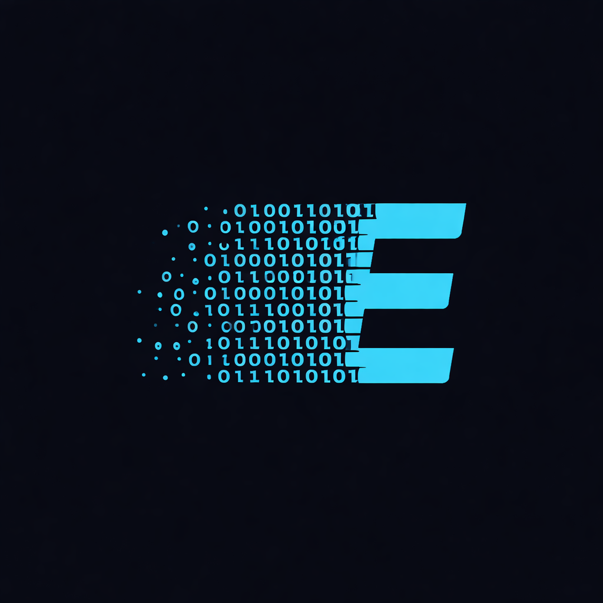
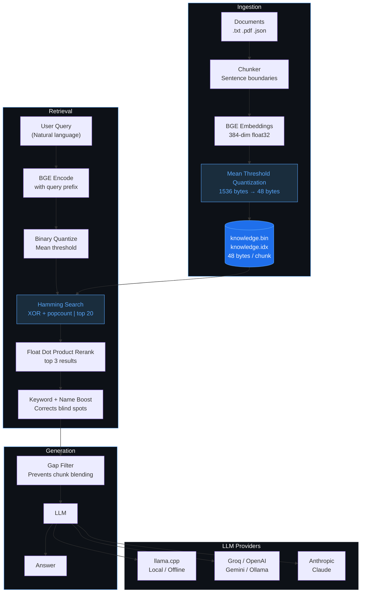

<div align="center">



# EdgeMind

**Lightweight semantic retrieval for edge devices and robotics**

[](https://python.org)
[](LICENSE)
[](https://github.com/gabrielav2004/EdgeMind)

*No vector database. No cloud required. Just two files.*

</div>

---

## Quick Start

```bash
git clone https://github.com/gabrielav2004/EdgeMind
cd EdgeMind
```

```bash
# linux / mac
./install.sh

# windows
install.bat
```

Add your documents to `data/docs/`, then:

```bash
edgemind ingest data/docs
edgemind interactive
```

Or with Docker... just kidding. It's two files and a Python script.

---

## The Problem

Most RAG systems assume you have a GPU, a vector database, and a cloud connection.

What if your hardware is a Raspberry Pi?

EdgeMind is built for that. Semantic search that runs on constrained hardware — robots, tablets, embedded systems — with no cloud dependency and no database to manage.

---

## Architecture

EdgeMind is built around three stages — ingestion, retrieval, and generation.



**Ingestion** — documents are split at sentence boundaries, encoded into 384-dimensional vectors using BGE embeddings, then compressed to 48-byte binary vectors using mean threshold quantization. The result is stored in two flat binary files.

**Retrieval** — queries go through the same encoding and quantization pipeline. Search runs in three stages: hamming distance narrows the full database to 20 candidates using pure bit operations, float dot product reranks those candidates with full precision, and a keyword and name boost corrects for semantic blind spots.

**Generation** — a gap filter checks if the top result scores significantly higher than the rest. If so, only that chunk is sent to the LLM to prevent answer blending. The LLM then generates a grounded, single-sentence answer.

**The core insight:** A 384-dimensional float32 embedding is 1536 bytes. After mean threshold quantization the same embedding becomes 48 bytes — **32x smaller**. Search runs on hamming distance — XOR two bit strings and count the differences — which is far cheaper than floating point math and fits the entire database in CPU cache.

---

## Benchmark

Tested on AWS t2.micro — 1 vCPU, 1GB RAM (constrained edge proxy).

| Method | Top-1 Accuracy | Avg Latency |
|--------|---------------|-------------|
| Float cosine (baseline) | 5/5 (100%) | 0.480ms |
| Sign binary | 5/5 (100%) | 0.321ms |
| Mean binary (EdgeMind) | 5/5 (100%) | 0.038ms |

| Format | Bytes per embedding | Compression |
|--------|-------------------|-------------|
| Float32 | 1536 bytes | 1x |
| Binary (EdgeMind) | 48 bytes | **32x** |

Mean threshold binary matches float cosine accuracy at **32x compression** and **12x faster retrieval**. Full details in [BENCHMARK.md](BENCHMARK.md).

---

## Features

- **Binary embeddings** — 32x storage reduction vs float32, mean threshold quantization
- **Three-stage retrieval** — hamming search → dot product rerank → keyword + name boost
- **Portable knowledge base** — ingest on powerful hardware, copy two files to any device
- **Offline embedding model** — download once, runs fully offline on edge devices
- **Multi-provider LLM** — local (TinyLlama, Qwen2), cloud (Groq, OpenAI, Gemini, Ollama), or Anthropic
- **Smart chunking** — splits at sentence boundaries, never mid-sentence
- **FastAPI service** — REST API for network access from mobile and other devices
- **Single config file** — one file to rule them all

---

## Installation

```bash
git clone https://github.com/gabrielav2004/EdgeMind
cd EdgeMind
```

| Platform | Command |
|----------|---------|
| Linux / Raspberry Pi / EC2 | `./install.sh` |
| Mac | `./install.sh` |
| Windows | `install.bat` |

The installers handle CPU-only torch to avoid pulling CUDA dependencies (~2GB) on edge hardware.

**Manual install:**
```bash
pip install torch --index-url https://download.pytorch.org/whl/cpu
pip install -e .
```

**With local model support:**
```bash
pip install torch --index-url https://download.pytorch.org/whl/cpu
pip install -e ".[local]"
```

**With llama.cpp server:**
```bash
pip install torch --index-url https://download.pytorch.org/whl/cpu
pip install -e ".[server]"
```

---

## Configuration

EdgeMind supports two ways to configure — a `.env` file for secrets and `edgemind/core/config.py` for everything else.

### .env file

Create a `.env` file at the project root for your API keys and tokens. EdgeMind loads this automatically on startup:

```bash
# .env
API_KEY=your-api-key-here
HF_TOKEN=hf_your_token_here     # optional — faster model downloads
```

### config.py

Edit `edgemind/core/config.py` for mode, model, and retrieval settings.

**Local mode:**
```python
MODE = "local"
MODEL_PATH = "models/tinyllama.gguf"
```

**Cloud mode:**
```python
MODE = "cloud"
API_BASE_URL = "https://api.groq.com/openai/v1"
MODEL_NAME = "llama3-8b-8192"
# API_KEY is loaded from .env
```

**Anthropic:**
```python
MODE = "anthropic"
MODEL_NAME = "claude-haiku-4-5-20251001"
# API_KEY is loaded from .env
```

> Never hardcode API keys in `config.py`. Use `.env` instead. The `.env` file is gitignored by default.

### Compatible Providers

| Provider | API_BASE_URL | Notes |
|----------|-------------|-------|
| Groq | https://api.groq.com/openai/v1 | free tier, recommended |
| OpenAI | https://api.openai.com/v1 | gpt-4o-mini |
| Gemini | https://generativelanguage.googleapis.com/v1beta/openai/ | free tier |
| Ollama | http://localhost:11434/v1 | local, no key needed |
| llama.cpp server | http://localhost:8080/v1 | fastest local option |
| Anthropic | use MODE = "anthropic" | separate SDK |

---

## Usage

```bash
# ingest documents
edgemind ingest data/docs

# single query
edgemind query "how many registrations were made"

# interactive mode
edgemind interactive

# download embedding model for offline use
edgemind download-model

# start API server
python serve.py
```

All commands also work via `python run.py <command>`.

---

## API

```bash
# health check
curl http://localhost:8000/health

# query with response
curl -X POST http://localhost:8000/query \
  -H "Content-Type: application/json" \
  -d '{"text": "who is Mr. Karthik"}'

# retrieval only
curl -X POST http://localhost:8000/query \
  -H "Content-Type: application/json" \
  -d '{"text": "who is Mr. Karthik", "respond": false}'

# ingest
curl -X POST "http://localhost:8000/ingest?folder=data/docs"
```

Swagger docs at `http://localhost:8000/docs`

---

## Portable Knowledge Base

Ingest on a powerful machine, deploy anywhere.

```
Powerful machine
  └── cloud LLM formatter + BGE embeddings
  └── outputs knowledge.bin + knowledge.idx
          ↓
    copy two files
          ↓
Edge device (Raspberry Pi, Jetson, tablet)
  └── loads binary file
  └── runs hamming search
  └── tiny memory footprint
```

The binary files have zero dependency on the machine, OS, or Python version that created them. The only constraint — the embedding model must match on both machines.

### Offline Embedding Model

Download the embedding model once on a powerful machine, then copy it to your edge device:

```bash
# on powerful machine — run once
edgemind download-model
# saves to models/embeddings/

# copy to edge device along with knowledge.bin and knowledge.idx
# on edge device — no internet needed
edgemind interactive
```

---

## Deployment

### Low RAM Devices (1GB)

Add swap before running on memory-constrained hardware:

```bash
sudo fallocate -l 1G /swapfile
sudo chmod 600 /swapfile
sudo mkswap /swapfile
sudo swapon /swapfile
```

### llama.cpp Server Mode

Faster than Python bindings, model stays permanently warm:

```bash
pip install -e ".[server]"
python -m llama_cpp.server --model models/tinyllama.gguf --port 8080 --n_threads 3
```

Point EdgeMind to it via `.env` and `config.py`:
```bash
# .env
API_KEY=none
```
```python
# config.py
MODE = "cloud"
API_BASE_URL = "http://localhost:8080/v1"
MODEL_NAME = "tinyllama"
```

### Mobile and Tablet

Run EdgeMind on a local edge server, devices call the API over the network:

```
Raspberry Pi / edge server
  └── llama.cpp server
  └── EdgeMind serve.py
        ↑
   local WiFi
        ↑
  Mobile / Tablet
  (POST to /query)
```

### Thread Count for Edge Devices

| Device | Cores | Recommended Threads |
|--------|-------|---------------------|
| Raspberry Pi 4 | 4 | 3 |
| Raspberry Pi 5 | 4 | 3 |
| Jetson Nano | 4 | 3 |
| Jetson Orin | 6 | 5 |

Always leave one core free for the OS.

---

## Supported Formats

- `.txt` — plain text
- `.pdf` — via pypdf
- `.json` — recursively flattened

---

## Local Model Options

| Model | Size | Quality | RAM |
|-------|------|---------|-----|
| TinyLlama 1.1B Q4 | 670MB | good | 2GB+ |
| TinyLlama 1.1B Q2 | 400MB | decent | 1.5GB+ |
| Qwen2 0.5B Q4 | 350MB | decent | 1GB+ |
| SmolLM2 135M Q4 | 95MB | minimal | 512MB+ |

---

## LLM Formatter

EdgeMind can optionally rewrite documents into clean structured paragraphs before chunking using the configured LLM.

```python
USE_LLM_FORMATTER = True   # works well with cloud models
USE_LLM_FORMATTER = False  # default, safe for all setups
```

**Use it when:** PDFs with broken formatting, documents with messy line endings.

**Avoid it when:** Clean text files, factual documents with names and numbers. Small local models hallucinate during reformatting — silently changing names and inventing facts. Only enable with a capable cloud model (GPT-4, Claude, Llama3 8B+).

---

## Performance

| Metric | Value |
|--------|-------|
| Storage per chunk | ~50 bytes + text |
| Hamming search (1k chunks) | < 5ms |
| Dot product rerank (20 candidates) | ~20ms |
| Mean binary retrieval latency | 0.038ms |
| Embedding model load (cached) | < 1s |

---

## Project Structure

```
EdgeMind/
  edgemind/
    cli.py             # CLI entry point
    core/
      config.py        # all settings
      models_cache.py  # singleton embedding model + offline support
    ingestion/
      parse.py         # document parsing + chunking
      store.py         # binary database writer
    retrieval/
      search.py        # three-stage retrieval
    generation/
      respond.py       # multi-provider response
  run.py               # convenience wrapper
  serve.py             # FastAPI service
  benchmark.py         # retrieval accuracy benchmarks
  install.sh           # linux / mac installer
  install.bat          # windows installer
  pyproject.toml       # package config
  .env                 # API keys and tokens (gitignored)
  data/
  models/
    embeddings/        # cached embedding model for offline use
```

---

## Roadmap

- [x] Binary embedding pipeline with mean threshold quantization
- [x] Flat binary database — portable across machines
- [x] Three-stage retrieval: hamming + dot product rerank + keyword/name boost
- [x] Gap filter to prevent chunk blending in responses
- [x] Smart chunking at sentence boundaries
- [x] BGE retrieval-optimized embedding model
- [x] Offline embedding model support
- [x] HuggingFace token support
- [x] dotenv support for API keys and secrets
- [x] Multi-provider response generation
- [x] FastAPI service
- [x] Refactored into proper Python package
- [x] pip installable via pyproject.toml
- [x] Cross-platform installers (Linux, Mac, Windows)
- [x] Benchmarked on constrained hardware (AWS t2.micro)
- [ ] llama.cpp native embeddings — eliminate HuggingFace dependency
- [ ] Embedding provider support (ollama, openai, cohere)
- [ ] C implementation of hamming search
- [ ] Raspberry Pi 4 validated deployment
- [ ] PyPI release

---

## Contributing

Contributions welcome. Open an issue first for major changes.

```bash
git clone https://github.com/gabrielav2004/EdgeMind
cd EdgeMind
./install.sh  # linux / mac
install.bat   # windows
```

---

## License

MIT — see [LICENSE](LICENSE)

---

<div align="center">
Built for the edge. Inspired by <a href="https://github.com/gabrielav2004/EdgeMind">Nephele</a>.
</div>
